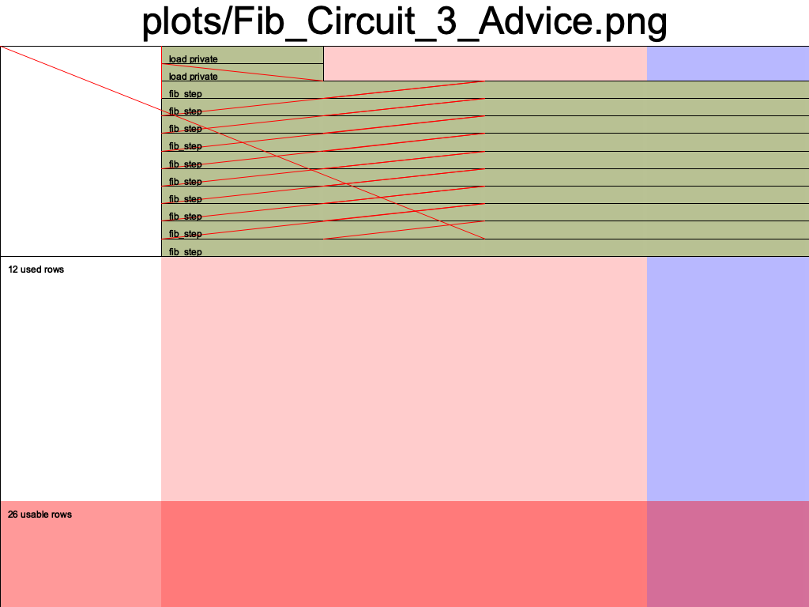
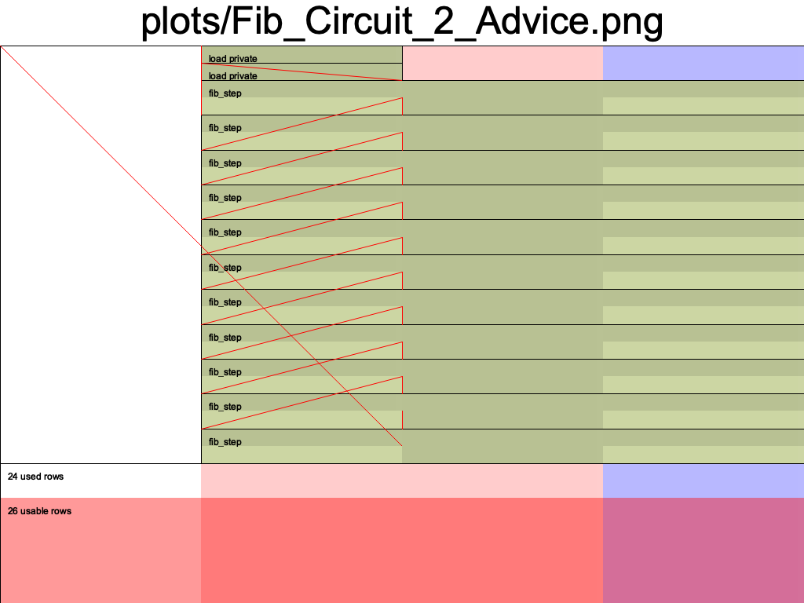

# Halo2 Fibonacci Calculation
Two different implementations of a Fibonacci Sequence calculation in [Halo2](https://zcash.github.io/halo2/).

Uses the [PSE halo2 fork](https://github.com/privacy-scaling-explorations/halo2) which allows IPA or KZG backends.


# Cmds
`cargo run --release`
```
Usage: halo2_fib [OPTIONS]

Options:
      --run-alt                Run alt fib constraint layout
      --plot                   Create plot of circuit layout
      --num-steps <NUM_STEPS>  [default: 180]
  -h, --help                   Print help information
  -V, --version                Print version information
```

Tests: `cargo test`

## `fib.rs`: 3 Advice Columns


```
| a | b | c |
|---|---|---|
| 0 | 1 | 1 |
| 1 | 1 | 2 |
| 1 | 2 | 3 |
| 2 | 3 | 5 |
....
```

## `fib2.rs`: 2 Advice Columns


```
| a | b |
|---|---|
| 0 | 1 |
| 1 | 1 |
| 1 | 2 |
| 2 | 3 |
| 3 | 5 |
...
```